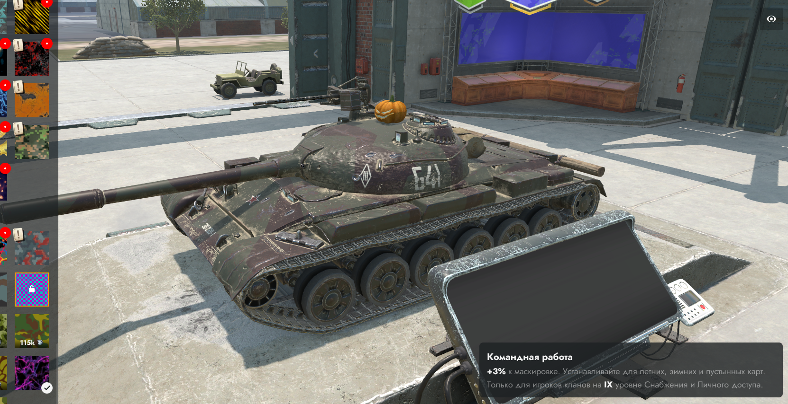

# Dava Skin Swither
### Описание
 Набор программ, позволяющий изменять свойства камуфляжа для изменения визуализации.
 Распаковка и упаковка конфигураций в удобные для работы форматы.

### Прочие инструкции
* [Main Readme](.info/local/README.TXT)

* [YAML Info](.info/local/YAML.YAML)

* [XML Info](.info/local/XML.XML)

### Установка
1. Скачайте `python` с официального сайта.
2. Скачайте все нужные модули для скриптов.
3. Используйте как это описано в инструкции.

### END?
